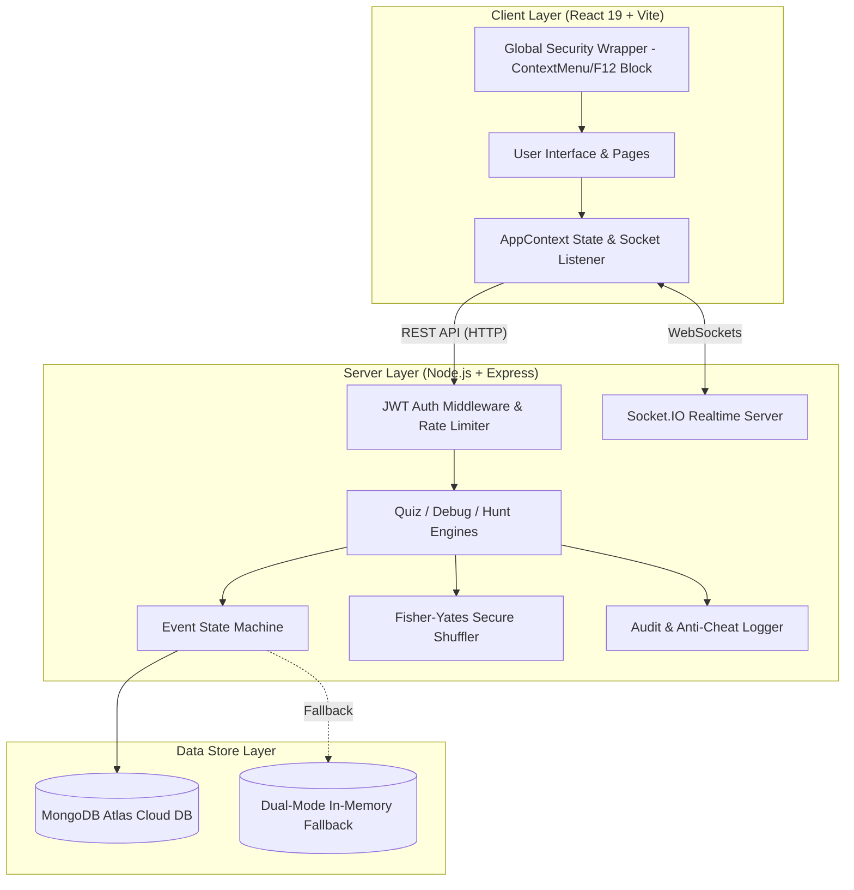
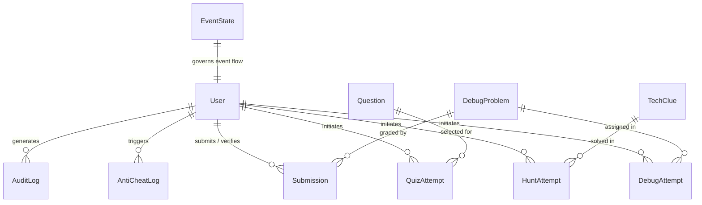

# FESTRONIX TECHNOVA 2026 — Master System Documentation

> **Official Symposium Event Management & Competition Platform**  
> *Department of Computer Science & Engineering | K. Ramakrishnan College of Technology (KRCT)*  
> **Theme:** Code the Ideas • Build the Tomorrow | **Tagline:** Decode, Debug & Discover

> [!IMPORTANT]
> **Bespoke & Event-Exclusive Architecture**  
> Unlike generic or off-the-shelf competition platforms, **FESTRONIX Technova** is a **custom-engineered, purpose-built platform created uniquely and exclusively for this single event** (FESTRONIX 2026 Technical Symposium at KRCT). Every workflow—from server-side question randomization to Round 2 physical terminal PIN verification and Round 3 multi-station treasure hunting—is tailored specifically to the exact operational structure, rules, and lab setup of the Technova competition as specified in the master system request document ([`system`](system)).

---

## 1. Executive Overview

**FESTRONIX Technova** is an end-to-end technical symposium event management and competitive examination system built specifically for the **FESTRONIX 2026 Symposium**. The software is uniquely crafted for this event's three progressive competition rounds:

1. **ROUND 1 — TECH QUIZ (Decode):** Automated multiple-choice technical examination powered by server-side Fisher-Yates question randomization, option shuffling, strict time tracking, and instant automated evaluation.
2. **ROUND 2 — DEBUG IT (Debug):** Practical code debugging challenge where participants write corrected code on local IDE terminals and request lab coordinators for physical terminal execution inspection and PIN-authenticated score verification.
3. **ROUND 3 — TECH HUNT (Discover):** Multi-station technical treasure hunt with sequential clue solving, hint penalties, and real-time score tracking.

```
┌─────────────────────────────────────────────────────────────────────────┐
│                        FESTRONIX TECHNOVA PLATFORM                       │
└─────────────────────────────────────────────────────────────────────────┘
        │                                  │                                  │
        ▼                                  ▼                                  ▼
┌──────────────┐                  ┌────────────────┐                 ┌────────────────┐
│ Participant  │                  │  Lab/Faculty   │                 │   Super Admin  │
│   Portal     │                  │  Coordinators  │                 │ Control Center │
└──────────────┘                  └────────────────┘                 └────────────────┘
        │                                  │                                  │
        └──────────────────────────┬───────┴──────────────────────────────────┘
                                   ▼
┌─────────────────────────────────────────────────────────────────────────┐
│                     REST API & REAL-TIME SOCKET.IO                      │
└─────────────────────────────────────────────────────────────────────────┘
                                   │
                                   ▼
┌─────────────────────────────────────────────────────────────────────────┐
│         MONGODB ATLAS / DUAL-MODE IN-MEMORY PERSISTENCE STORE           │
└─────────────────────────────────────────────────────────────────────────┘
```

### Core Problems Solved

* **Elimination of Paper & Fragmented Tools:** Replaces disconnected quiz platforms, paper answer sheets, and manual score spreadsheets with a unified system.
* **Cheating Mitigation & Examination Security:** Combines server-side payload sanitization (hiding correct answers and solution snippets), keyboard shortcut/right-click disabling, window focus tracking telemetry, and mandatory physical coordinator verification.
* **Fair Content Distribution:** Server-side Fisher-Yates shuffling ensures every participant receives a uniquely ordered set of questions and shuffled options.
* **Physical Lab Verification:** Solves the problem of unverified code submissions by requiring lab coordinators to inspect physical terminal execution and authorize scores via secure 4-digit PINs.
* **Fault-Tolerant Architecture:** Features dual-mode persistence (MongoDB Atlas cloud connection with fallback to local dynamic memory store) and a 5-second automatic heartbeat sync for offline-first resilience.

---

## 2. Implemented Roles & Responsibility Matrix

The system implements Role-Based Access Control (RBAC) across database schemas (`User.role`), JWT payload claims, backend middleware (`authenticateToken`, `authorizeRole`), frontend context (`AppContext.jsx`), and conditionally rendered UI routes.

### Actual User Roles Identified

| Role Enum | System Identity | Access Level & UI Scope | Main Capabilities |
| :--- | :--- | :--- | :--- |
| `ADMIN` | Super Admin / Faculty / Faculty In-Charge | `/admin` (`AdminPortal.jsx`) | Event state machine control, qualification limit management, full question bank management, anti-cheat audit logs, live leaderboard oversight. |
| `COORDINATOR` | Student Coordinators / Lab Co-Coordinators | `/coordinator` (`CoordinatorPortal.jsx`, `CoordinatorModal.jsx`) | Physical terminal execution verification queue, PIN authentication grading, question/clue bank content management. |
| `PARTICIPANT` | Student Contestants | `/dashboard`, `/round1`, `/round2`, `/round3` | Event registration/login, Round 1 Quiz attempt, Round 2 Debug code submission, Round 3 Tech Hunt clue solving, personal score tracking. |

### "Who Does What?" Responsibility Matrix

| Activity | Faculty (Admin) | Faculty In-Charge (Admin) | Coordinator | Co-Coordinator | Student (Participant) |
| :--- | :---: | :---: | :---: | :---: | :---: |
| Event State Control | ✅ | ✅ | ❌ | ❌ | ❌ |
| Set Qualification Limits | ✅ | ✅ | ❌ | ❌ | ❌ |
| Create / Edit Questions | ✅ | ✅ | ✅ | ✅ | ❌ |
| JSON Bulk Import / Export | ✅ | ✅ | ✅ | ✅ | ❌ |
| Inspect Lab Executions | ❌ | ❌ | ✅ | ✅ | ❌ |
| Physical PIN Verification | ❌ | ❌ | ✅ | ✅ | ❌ |
| View Anti-Cheat Logs | ✅ | ✅ | ❌ | ❌ | ❌ |
| Register & Participate | ❌ | ❌ | ❌ | ❌ | ✅ |
| Submit Quiz / Code / Clues | ❌ | ❌ | ❌ | ❌ | ✅ |

---

## 3. Operations & User Journeys

### Faculty & Faculty In-Charge Guide

```text
Login (ADMIN-01) ──► Admin Control Center ──► Set Stage (e.g. ROUND_1_RUNNING)
                                                   │
   ┌───────────────────────────────────────────────┴───────────────────────────────┐
   ▼                                               ▼                               ▼
Manage Limits                   Question & Content Hub                  Anti-Cheat Telemetry
(Set R1=30, R2=10)             (Create/Import MCQs, Debug, Clues)      (Audit Tab Switches)
```

1. **Log in:** Sign in using Admin credentials (`ADMIN-01` / `admin123`).
2. **Access Control Center:** Navigate to the `/admin` portal.
3. **Configure Event State:** Select active state (`REGISTRATION`, `ROUND_1_RUNNING`, `ROUND_2_RUNNING`, `ROUND_3_RUNNING`, `COMPLETED`) to control participant progression.
4. **Set Qualification Limits:** Specify total registration capacity, Round 1 qualification count (e.g. 30), and Round 2 qualification count (e.g. 10).
5. **Manage Content Bank:** Open the Question Bank Hub tab to create, edit, delete, clone, or bulk import/export JSON question sets for all three rounds.
6. **Monitor Event & Telemetry:** Review live leaderboards and inspect recorded anti-cheat tab-blur security logs.

### Student Coordinator & Co-Coordinator Guide

```text
Login (COORD-01) ──► Coordinator Workspace ──► Select Verification Queue
                                                      │
                                                      ▼
Student Raises Hand ──► Inspect Terminal ──► Click "Perform Physical Verification"
                                                      │
                                                      ▼
                  Enter PIN (1234) + Award Marks ──► Score Recorded & Live Streamed
```

1. **Log in:** Sign in using Coordinator credentials (`COORD-01` / `coord123`).
2. **Access Workspace:** Navigate to the `/coordinator` portal.
3. **Monitor Verification Queue:** View incoming Round 2 code submissions marked `WAITING VERIFICATION`.
4. **Physical Inspection:** Walk to the participant's physical lab terminal, review code execution in VS Code/terminal against expected output.
5. **Authorize Score:** Click **Perform Physical Verification** on screen, enter Coordinator ID (`COORD-01`) and 4-digit authorization PIN (`1234`), select awarded marks (up to 10), and submit.
6. **Manage Questions:** Switch to the Content Management Hub tab to review or add competition questions.

### Student Participant Journey

```text
Register (TN2026-xxx) ──► Login ──► Participant Dashboard
                                           │
  ┌────────────────────────────────────────┼────────────────────────────────────────┐
  ▼                                        ▼                                        ▼
Round 1: Tech Quiz                Round 2: Debug It!               Round 3: Tech Hunt
(MCQ + Server Timer)              (Local IDE + Coord PIN)          (5 Clue Stations)
  │                                        │                                        │
  ▼                                        ▼                                        ▼
Automated Evaluation             Physical Verification             Station Completion
  │                                        │                                        │
  └────────────────────────────────────────┴────────────────────────────────────────┘
                                           │
                                           ▼
                               Live Scoreboard & Rank
```

1. **Registration / Login:** Enter assigned Participant ID (`TN2026-001`) and password (`user123`).
2. **Dashboard Overview:** Access `/dashboard` to view profile details, event announcements, and active round status.
3. **Round 1 (Tech Quiz):** Enter fullscreen mode, answer server-randomized questions within 20 minutes, and submit for instant automated evaluation.
4. **Round 2 (Debug It):** Read broken code, write solution in local IDE, submit code/output on portal, and call a coordinator for physical verification.
5. **Round 3 (Tech Hunt):** Solve sequential station clues, request hints if needed, and submit text answers to unlock subsequent stations.
6. **Track Performance:** View live scores and qualification status on the leaderboard.

---

## 4. Technical Architecture

### Architecture Overview



### Technology Stack Summary

| Layer | Technology | Version / Details | Purpose |
| :--- | :--- | :--- | :--- |
| **Frontend Framework** | React.js | `^19.2.8` | Component-based single page UI |
| **Build Tool** | Vite | `^8.3.0` | Fast development server & production bundler |
| **Styling** | Tailwind CSS | `^4.3.3` | Utility-first responsive dark/light styling |
| **Icons** | Lucide React | `^1.47.0` | Modern UI icon library |
| **Realtime Client** | Socket.IO Client | `^4.8.3` | Live event state & verification updates |
| **Backend Runtime** | Node.js | ES Modules (`"type": "module"`) | Server runtime environment |
| **Web Server** | Express.js | `^4.19.2` | RESTful API routing & server middleware |
| **Realtime Server** | Socket.IO | `^4.7.5` | WebSockets server for real-time broadcasts |
| **Database ORM** | Mongoose | `^8.3.1` | MongoDB data modeling & schema validation |
| **Authentication** | JSON Web Tokens | `jsonwebtoken ^9.0.2` | Stateless bearer token authentication |
| **Security / Hashing**| Bcrypt.js | `^3.0.3` | Password hashing & verification |

---

## 5. Question Randomization & Exam Engine Workflow

The Round 1 quiz engine implements a strict **server-side secure randomization and sanitization pipeline** to prevent cheat attempts, option leakage, or static answer copying.

```mermaid
sequenceDiagram
    autonumber
    actor Participant
    participant Client as React Client
    participant Server as Express Engine
    participant Crypto as Crypto Module
    participant DB as MongoDB / Store

    Participant->>Client: Click "Start Round 1 Quiz"
    Client->>Server: POST /api/quiz/start { participantId }
    Server->>DB: Check for existing QuizAttempt
    alt Attempt Exists
        DB-->>Server: Return existing attempt & userAnswers
        Server-->>Client: Return stored attempt (NO re-randomization)
    else New Attempt
        Server->>DB: Fetch ACTIVE Question Bank
        DB-->>Server: Return active questions
        Server->>Crypto: Fisher-Yates shuffle question bank array
        Crypto-->>Server: Return shuffled questions (sliced to maxQuestions)
        loop For each selected question
            Server->>Crypto: Fisher-Yates shuffle options array
            Server->>Server: Map original correct answer text to new index
        end
        Server->>DB: Save QuizAttempt (selectedQuestions + correctOptionIndex)
        Server-->>Client: Return SANITIZED payload (questions, options, endsAt)
    end
    Note over Client: Client renders quiz (NO correct answers in DOM/memory)
    Participant->>Client: Select option for Question
    Client->>Server: POST /api/quiz/answer { participantId, questionId, selectedOption }
    Server->>DB: Persist user answer in QuizAttempt.userAnswers map
    Participant->>Client: Click "Submit Quiz" (or Timer Expires)
    Client->>Server: POST /api/quiz/submit { participantId }
    Server->>Server: Compare userAnswers against stored correctOptionIndex
    Server->>DB: Calculate score, set status='SUBMITTED', record Submission
    Server-->>Client: Return score & submission confirmation
```

### Key Security Safeguards in Exam Engine

1. **Fisher-Yates Cryptographic Shuffle:** Questions and option order are shuffled using 32-bit cryptographically random buffers (`crypto.randomBytes(4)`).
2. **Payload Sanitization:** The `/api/quiz/start` and `/api/quiz/current` endpoints filter out `correctOption`, `correctOptionIndex`, and `explanation` before sending JSON to the browser.
3. **Server-Side Evaluation:** Answers are graded strictly on the server by comparing submitted option indices against stored attempt maps.
4. **Attempt Re-hydration:** Re-opening or refreshing the quiz retrieves the existing shuffled question set and answers from the database without re-shuffling.

---

## 6. Complete API Reference

All backend API endpoints are exposed on port `5000` (or `process.env.PORT`).

### Authentication Endpoints

| Method | Endpoint | Access Level | Description |
| :--- | :--- | :--- | :--- |
| `POST` | `/api/auth/login` | Public (Rate-limited: 10/min) | Authenticates credentials, verifies Bcrypt password, issues 12h JWT token. |
| `POST` | `/api/auth/register` | Public | Registers a new participant, generates auto-incremented `TN2026-xxx` ID. |

### Event State & Leaderboard Endpoints

| Method | Endpoint | Access Level | Description |
| :--- | :--- | :--- | :--- |
| `GET` | `/` | Public | Server health message & API index. |
| `GET` | `/api/health` | Public | Returns database connection status and server timestamp. |
| `GET` | `/api/event/status` | Public | Returns current event state machine object. |
| `PUT` | `/api/event/settings` | `ADMIN` | Updates event status and qualification limits; emits Socket.IO update. |
| `GET` | `/api/dashboard/stats` | Public | Aggregates system metrics (registered count, submissions, verifications). |
| `GET` | `/api/leaderboard` | Public | Calculates aggregated total scores across all 3 rounds and ranks participants. |

### Round 1 — Quiz Engine Endpoints

| Method | Endpoint | Access Level | Description |
| :--- | :--- | :--- | :--- |
| `POST` | `/api/quiz/start` | `PARTICIPANT` | Generates or restores a randomized 20-minute quiz attempt; returns sanitized questions. |
| `GET` | `/api/quiz/current` | `PARTICIPANT` | Fetches active quiz attempt state and sanitized questions. |
| `POST` | `/api/quiz/answer` | `PARTICIPANT` | Saves selected option index for a question in real-time. |
| `POST` | `/api/quiz/submit` | `PARTICIPANT` | Evaluates answers, records score, marks attempt as `SUBMITTED`. |

### Round 2 — Debug Engine Endpoints

| Method | Endpoint | Access Level | Description |
| :--- | :--- | :--- | :--- |
| `POST` | `/api/debug/start` | `PARTICIPANT` | Assigns 3 active debug problems; returns sanitized problem code/descriptions. |
| `GET` | `/api/debug/current` | `PARTICIPANT` | Fetches assigned debug problems for current participant attempt. |
| `POST` | `/api/debug/submit` | `PARTICIPANT` | Submits corrected solution code and output; queue status becomes `SUBMITTED`. |
| `GET` | `/api/coordinator/submissions` | `COORDINATOR` / `ADMIN` | Fetches queue of debug submissions requiring physical verification. |
| `POST` | `/api/coordinator/verify` | `COORDINATOR` / `ADMIN` | Authenticates Coordinator ID and 4-digit PIN; awards/modifies verification marks. |

### Round 3 — Tech Hunt Endpoints

| Method | Endpoint | Access Level | Description |
| :--- | :--- | :--- | :--- |
| `POST` | `/api/hunt/start` | `PARTICIPANT` | Initializes 5-station tech hunt attempt; returns current station clue. |
| `GET` | `/api/hunt/current` | `PARTICIPANT` | Fetches current hunt station status and active clue payload. |
| `POST` | `/api/hunt/:clueId/answer` | `PARTICIPANT` | Validates case-insensitive answer text; unlocks next station upon success. |
| `POST` | `/api/hunt/:clueId/hint` | `PARTICIPANT` | Unlocks station hint and records hint penalty flag. |

### Admin Content Management Hub Endpoints

| Method | Endpoint | Access Level | Description |
| :--- | :--- | :--- | :--- |
| `GET` | `/api/admin/questions` | `ADMIN` / `COORDINATOR` | Fetches MCQ bank with optional search, category, difficulty, status filters. |
| `POST` | `/api/admin/questions` | `ADMIN` / `COORDINATOR` | Creates a new MCQ question; performs duplicate text check. |
| `PUT` | `/api/admin/questions/:id` | `ADMIN` / `COORDINATOR` | Updates existing MCQ question parameters. |
| `DELETE` | `/api/admin/questions/:id` | `ADMIN` / `COORDINATOR` | Removes MCQ question from bank. |
| `POST` | `/api/admin/questions/import` | `ADMIN` / `COORDINATOR` | Bulk imports MCQ array from JSON. |
| `GET` | `/api/admin/questions/export` | `ADMIN` / `COORDINATOR` | Exports full MCQ bank as downloadable JSON array. |
| `GET` | `/api/admin/debug-problems` | `ADMIN` / `COORDINATOR` | Fetches debug problems bank with filters. |
| `POST` | `/api/admin/debug-problems` | `ADMIN` / `COORDINATOR` | Creates a new debug problem. |
| `PUT` | `/api/admin/debug-problems/:id` | `ADMIN` / `COORDINATOR` | Updates debug problem parameters. |
| `DELETE` | `/api/admin/debug-problems/:id` | `ADMIN` / `COORDINATOR` | Removes debug problem from bank. |
| `POST` | `/api/admin/debug-problems/import` | `ADMIN` / `COORDINATOR` | Bulk imports debug problems array. |
| `GET` | `/api/admin/debug-problems/export` | `ADMIN` / `COORDINATOR` | Exports debug problems array as JSON. |
| `GET` | `/api/admin/clues` | `ADMIN` / `COORDINATOR` | Fetches tech clues bank with station/category filters. |
| `POST` | `/api/admin/clues` | `ADMIN` / `COORDINATOR` | Creates a new tech clue. |
| `PUT` | `/api/admin/clues/:id` | `ADMIN` / `COORDINATOR` | Updates tech clue parameters. |
| `DELETE` | `/api/admin/clues/:id` | `ADMIN` / `COORDINATOR` | Removes tech clue from bank. |
| `POST` | `/api/admin/clues/import` | `ADMIN` / `COORDINATOR` | Bulk imports tech clues array. |
| `GET` | `/api/admin/clues/export` | `ADMIN` / `COORDINATOR` | Exports tech clues array as JSON. |

### Announcements & Security Telemetry Endpoints

| Method | Endpoint | Access Level | Description |
| :--- | :--- | :--- | :--- |
| `GET` | `/api/announcements` | Public | Fetches list of live event announcements. |
| `POST` | `/api/announcements` | `ADMIN` / `COORDINATOR` | Broadcasts a new event announcement over Socket.IO. |
| `GET` | `/api/anticheat/logs` | `ADMIN` | Fetches recorded tab blur and window unfocus security logs. |
| `POST` | `/api/anticheat/log` | `PARTICIPANT` (Automated) | Records a tab blur or window switch security signal. |
| `GET` | `/api/admin/audit-logs` | `ADMIN` | Fetches system operational audit log history. |

---

## 7. Database Architecture

The system uses **Mongoose (MongoDB)** with 12 collections defined in `server/src/models.js`. If MongoDB Atlas is offline or unreachable, the server automatically defaults to `memoryStore` without crashing.



### Database Collections Reference

| Collection Model | Primary Purpose | Key Fields | Key Relationships |
| :--- | :--- | :--- | :--- |
| `User` | User account profiles & credentials | `id`, `name`, `email`, `role`, `password`, `accountStatus`, `pin`, `permissions` | Linked to all attempts & submissions by `id`. |
| `EventState` | Global state machine & qualification limits | `status`, `round1MaxQuestions`, `round1DurationMinutes`, `round1QualifyCount`, `round2QualifyCount`, `registrationCount`, `activeRound` | Singleton record governing participant access. |
| `Question` | Round 1 MCQ question bank | `questionId`, `questionText`, `category`, `difficulty`, `options`, `correctOption`, `marks`, `explanation`, `status` | Referenced by `QuizAttempt.selectedQuestions`. |
| `QuizAttempt` | Persisted Round 1 quiz session per participant | `attemptId`, `participantId`, `selectedQuestions`, `userAnswers`, `startedAt`, `endsAt`, `submittedAt`, `status`, `score` | Links `participantId` to `Question` IDs and options. |
| `DebugProblem` | Round 2 debug code challenge bank | `problemId`, `title`, `description`, `language`, `difficulty`, `brokenCode`, `expectedOutput`, `solutionSnippet`, `marks`, `status` | Referenced by `DebugAttempt` & `Submission`. |
| `DebugAttempt` | Persisted Round 2 debug session | `attemptId`, `participantId`, `selectedProblemIds`, `startedAt`, `status` | Links `participantId` to assigned `DebugProblem` IDs. |
| `TechClue` | Round 3 tech hunt clue station bank | `clueId`, `station`, `category`, `title`, `clueText`, `answer`, `hint`, `hintPenalty`, `marks`, `status` | Referenced by `HuntAttempt`. |
| `HuntAttempt` | Persisted Round 3 treasure hunt state | `attemptId`, `participantId`, `selectedClueIds`, `currentClueIndex`, `solvedClueIds`, `hintsUsed`, `score`, `status` | Tracks participant progress through `TechClue` stations. |
| `Submission` | Solution code & physical verification ledger | `participantId`, `problemId`, `code`, `output`, `status`, `verifiedBy`, `marks`, `verifiedAt` | Connects `participantId`, `problemId`, and `coordinatorId`. |
| `Announcement` | Event broadcasts & announcements | `id`, `title`, `message`, `time`, `tag` | Displayed on participant dashboard. |
| `AntiCheatLog` | Recorded anti-cheat telemetry signals | `id`, `participantId`, `type`, `message`, `timestamp` | Audit log viewed in `/admin` portal. |
| `AuditLog` | System administrative action audit history | `userId`, `role`, `action`, `targetId`, `metadata`, `timestamp` | Immutably tracks admin and coordinator actions. |

---

## 8. Security & Telemetry Architecture

### Security Controls Matrix

| Security Feature | Implementation Mechanism | Code Location | Status |
| :--- | :--- | :--- | :--- |
| **Password Security** | Bcrypt hashing with salt rounds = 10 | `server/src/server.js` | **Implemented** |
| **JWT Authorization** | Stateless bearer token with 12h expiry | `server/src/server.js` | **Implemented** |
| **Login Rate Limiting** | Max 10 attempts per minute per IP | `server/src/server.js` | **Implemented** |
| **ContextMenu & Shortcut Block**| Disables right-click, F12, Ctrl+Shift+I/J/C, Ctrl+U, Ctrl+S | `client/src/App.jsx` | **Implemented** |
| **Window Blur Telemetry** | Detects `document.hidden` during rounds, logs to server & DB | `client/src/context/AppContext.jsx` | **Implemented** |
| **Payload Sanitization** | Strips correct answers, solution snippets, and answers before send | `server/src/server.js` | **Implemented** |
| **PIN-Based Lab Verification** | Requires coordinator ID + 4-digit PIN for score approval | `server/src/server.js`, `CoordinatorModal.jsx` | **Implemented** |
| **Offline Resilience** | Dual-mode memory store fallback + 5s heartbeat monitor | `server/src/server.js`, `AppContext.jsx` | **Implemented** |
| **Input Validation** | Required field checks & type parsing | `server/src/server.js` | **Implemented** |

> [!NOTE]
> Security telemetry flags (such as tab blur events) are logged for administrative review and do not automatically terminate student exams without coordinator intervention.

---

## 9. Project Directory Structure

```text
Technova/
├── .env                              # Master root environment configuration
├── .env.example                      # Sample root environment variable schema
├── .gitignore                        # Git ignore patterns
├── README.md                         # Master repository documentation (This File)
├── system                            # Master System Request & Requirements Specification Document
├── client/                           # React Frontend Application
│   ├── .env                          # Client environment file (VITE_API_BASE)
│   ├── .env.example                  # Client environment schema example
│   ├── index.html                    # Single Page Application HTML entrypoint
│   ├── package.json                  # Frontend dependencies & Vite scripts
│   ├── vite.config.js                # Vite build configuration (Port 5173)
│   └── src/
│       ├── App.jsx                   # Main App component & Security Wrapper
│       ├── App.css                   # Keyframe animations & glassmorphic styling
│       ├── index.css                 # Global CSS & Tailwind CSS directives
│       ├── main.jsx                  # React DOM root renderer
│       ├── config.js                 # API base path resolution helper
│       ├── theme.js                  # Design system color tokens
│       ├── assets/                   # Static images, favicons, logos
│       ├── components/
│       │   ├── ContentManagementHub.jsx # Universal MCQ/Debug/Clue Bank CRUD
│       │   ├── CoordinatorModal.jsx  # PIN Verification modal overlay
│       │   ├── Header.jsx            # Top application header bar
│       │   ├── Sidebar.jsx           # Main portal navigation sidebar
│       │   └── ProgressGauge.jsx     # Visual SVG gauge component
│       ├── context/
│       │   └── AppContext.jsx        # App state, auth, heartbeat, telemetry
│       ├── hooks/
│       │   └── useMotion.js          # Scroll reveal & animated counter hooks
│       └── pages/
│           ├── AdminPortal.jsx       # Super Admin Control Center (/admin)
│           ├── CoordinatorPortal.jsx # Coordinator Workspace (/coordinator)
│           ├── Dashboard.jsx         # Participant Main Dashboard (/dashboard)
│           ├── LandingPage.jsx       # Public Symposium Showcase Landing Page
│           ├── LoginPage.jsx         # Portal Authentication Login Page
│           ├── Round1Quiz.jsx        # Round 1 Tech Quiz Examination Page
│           ├── Round2Debug.jsx       # Round 2 Debug It Code Editor Page
│           ├── Round3Hunt.jsx        # Round 3 Tech Treasure Hunt Page
│           └── SplashScreen.jsx      # Animated Compiler Sandbox Hero Screen
└── server/                           # Node.js Express Backend Application
    ├── .env                          # Server environment configuration
    ├── .env.example                  # Server environment schema example
    ├── package.json                  # Backend dependencies & Node scripts
    └── src/
        ├── models.js                 # 12 Mongoose Schemas & Database Models
        ├── seed.js                   # Connection check utility script
        └── server.js                 # Primary Express REST API & Socket.IO server
```

---

## 10. Local Development & Installation Guide

### Prerequisites

* **Node.js:** `v18.0.0` or higher
* **npm:** `v9.0.0` or higher
* **MongoDB:** MongoDB Atlas Cloud Instance (or dynamic in-memory store if offline).

### Production Configuration & Setup Instructions

#### 1. Clone Repository & Install Dependencies

```bash
# Clone the repository
git clone https://github.com/TheOrionGD/Festronix2k26_TechNova.git
cd Festronix2k26_TechNova

# Install Server Dependencies
cd server
npm install

# Install Client Dependencies
cd ../client
npm install
```

#### 2. Production Environment Variables Setup

Create `.env` in `server/`:

```env
PORT=5000
DATABASE_URL=mongodb+srv://<username>:<password>@cluster.mongodb.net/technova?retryWrites=true&w=majority
MONGODB_URI=mongodb+srv://<username>:<password>@cluster.mongodb.net/technova?retryWrites=true&w=majority
JWT_SECRET=your_jwt_secret_key_here
```

Create `.env` in `client/`:

```env
VITE_BACKEND_URL=https://festronix2k26-technova.onrender.com
VITE_API_BASE_URL=https://festronix2k26-technova.onrender.com/api
```

#### 3. Default Credentials (Pre-Configured Out-of-the-Box)

The system automatically initializes default accounts if the database or memory store is empty:

| Role | User ID / Email | Password | PIN |
| :--- | :--- | :--- | :--- |
| **Admin** | `ADMIN-01` or `admin@technova.edu` | `admin123` | N/A |
| **Coordinator** | `COORD-01` or `coord@technova.edu` | `coord123` | `1234` |
| **Participant** | `TN2026-001` or `john@technova.edu` | `user123` | N/A |

#### 4. Run Servers (Production Server Deployment)

Start Backend Production Server:
```bash
cd server
npm start
# Production Live Server: https://festronix2k26-technova.onrender.com
```

Start Frontend Client:
```bash
cd client
npm run build && npm run preview
# Production Client URL: https://festronix2k26-technova.onrender.com (or Vercel client deployment)
```

---

## 11. Seed Data & Database Initialization

Inspection of `server/src/seed.js` confirms:

> **Notice:** Automatic seed mock insertion has been intentionally removed from this system. Database records are created dynamically through actual Admin and Coordinator workflows.

To check database connection without modifying records:
```bash
cd server
node src/seed.js
```

---

## 12. Automated Testing & Deployment Status

### Automated Testing Status

* **Status:** Unit and integration testing frameworks are not currently configured in package manifests. Code validation is performed via Oxlint (`npm run lint` in `/client`) and manual end-to-end API verification.

### Deployment Configuration Status

* **Frontend Deployment:** Prepared for deployment on Vercel (`client/vercel.json` included with single-page application routing rewrites).
* **Backend Deployment:** Prepared for deployment on Render, Railway, or AWS Node.js environments.

---

## 13. System Troubleshooting

| Symptom | Probable Cause | Resolution |
| :--- | :--- | :--- |
| **"SYSTEM OFFLINE" Toast Appears** | Express server on port 5000 is stopped or unreachable. | Verify backend server is running using `npm run dev` in `/server`. |
| **MongoDB Connection Warning in Terminal** | Invalid `MONGODB_URI` or local MongoDB service stopped. | System automatically falls back to in-memory store; start local MongoDB or update Atlas URI in `server/.env`. |
| **"Invalid Coordinator Authorization PIN"** | Incorrect PIN entered during Round 2 physical verification. | Use default Coordinator PIN `1234` or verify PIN set in database `User.pin`. |
| **Rate Limit 429 Error on Login** | Exceeded 10 login attempts within 1 minute from same IP. | Wait 60 seconds before retrying login. |
| **Quiz Timer Resets on Refresh** | Browser cache cleared or different user ID used. | Ensure participant logs in with the exact same `participantId`. Timer state is re-hydrated from `QuizAttempt.endsAt`. |

---

## 14. Implemented vs. Not Implemented Feature Audit

### Confirmed Implemented Features

* ✅ Full 3-Round Competition Pipeline (Tech Quiz, Debug It, Tech Hunt).
* ✅ Cryptographic Fisher-Yates Question & Option Shuffling.
* ✅ Payload Sanitization (Hiding correct answer fields from participant HTTP responses).
* ✅ Physical Lab Terminal Verification with 4-Digit Coordinator PINs.
* ✅ Multi-Station Tech Hunt with Hint Penalties.
* ✅ Dual-Mode Database Persistence (MongoDB Cloud Atlas + In-Memory Fallback).
* ✅ Real-time Updates via Socket.IO WebSockets.
* ✅ Keyboard Shortcut & Context-Menu Anti-Cheat Prevention.
* ✅ Tab-Blur and Window-Focus Switch Security Telemetry Logging.
* ✅ Complete Content Management Hub (CRUD + JSON Bulk Import/Export for MCQs, Debug Problems, Clues).
* ✅ Dynamic Event State Machine & Qualification Target Management.
* ✅ Aggregated Live Participant Leaderboard.

### Features Not Present in Current Codebase

* ❌ Automated Code Execution Sandbox (Docker / Judge0 compiler integration — Round 2 relies on physical lab coordinator inspection).
* ❌ Automated Email Verification / Password Reset via Email.
* ❌ Automated Certificate PDF Generation.
* ❌ Multi-Tenant Institution Separation (System is dedicated to FESTRONIX Technova 2026 at KRCT).

---

## 15. System Request & Master Requirements Specification (`system`)

The application architecture, data schemas, role permissions, and competition round workflows were engineered according to the comprehensive **System Request Specification** documented in [`system`](file:///o:/Festronix2k26_TechNova/system).

> [!NOTE]
> **Master Prompt Specification Source**  
> The file [`system`](file:///o:/Festronix2k26_TechNova/system) serves as the primary system specification prompt and architectural directive for the FESTRONIX Technova event management platform.

### Core Mandates from the System Request

1. **Unified 3-Round Event Pipeline (`TECHNOVA — Decode, Debug & Discover`):**
   - **Round 1 (Tech Quiz - Decode):** Automated 20-question MCQ technical assessment covering 24 CS domains (C, C++, Java, Python, Data Structures, Algorithms, DBMS, OS, Web, Security, AI). Features server-side Fisher-Yates question & option randomization, 20-minute timer, and auto-submission.
   - **Round 2 (Debug It - Debug):** Practical code debugging challenge. Contestants fix code on local IDE terminals and request physical lab inspection. Coordinators inspect execution and enter a secure 4-digit PIN (`1234`) to authorize and stream awarded marks.
   - **Round 3 (Tech Hunt - Discover):** 5-station technical treasure hunt with sequential clue solving, hint request time/score penalties, and immediate backend answer validation.

2. **Strict Role-Based Access Control (RBAC):**
   - Formally defined across database schemas (`User.role`), JWT token payloads, backend authorization middleware, and React frontend navigation:
     - `PARTICIPANT`: Portal registration/login, round participation, personal dashboard, live rank monitoring.
     - `COORDINATOR`: Verification queue management, physical terminal PIN authorization, question bank editing.
     - `ADMIN` / `SUPER_ADMIN`: Event state machine transitions (`REGISTRATION` ➔ `ROUND_1_RUNNING` ➔ `ROUND_2_RUNNING` ➔ `ROUND_3_RUNNING` ➔ `COMPLETED`), qualification cap settings (e.g., Top 30 for R2, Top 10 for R3), anti-cheat telemetry auditing, and live overall leaderboard control.

3. **Scale & Concurrency Constraints:**
   - Engineered to seamlessly support ~100 concurrent participants during Round 1, ~30 participants for Round 2, and ~10 finalists for Round 3.

4. **Security & Anti-Cheat Specification:**
   - Backend payload sanitization (stripping answer keys and solution fields before delivering payloads to participants).
   - Client security wrappers blocking keyboard shortcuts (F12, DevTools) and right-click context menus.
   - Tab switch and window blur tracking recorded in real-time anti-cheat audit logs.

5. **Resilient Dual-Mode Data Store:**
   - Primary persistence with MongoDB Atlas cloud database.
   - Dynamic in-memory persistence fallback to ensure zero downtime during campus network or internet disruptions.

---

*Documentation generated following complete file-by-file codebase analysis of Festronix Technova 2026.*
