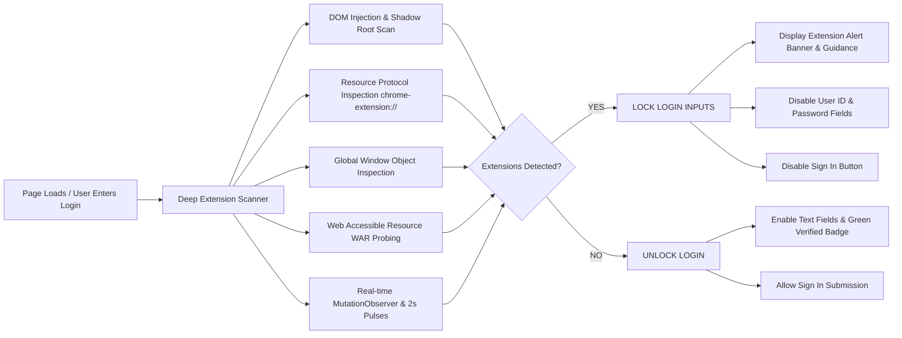
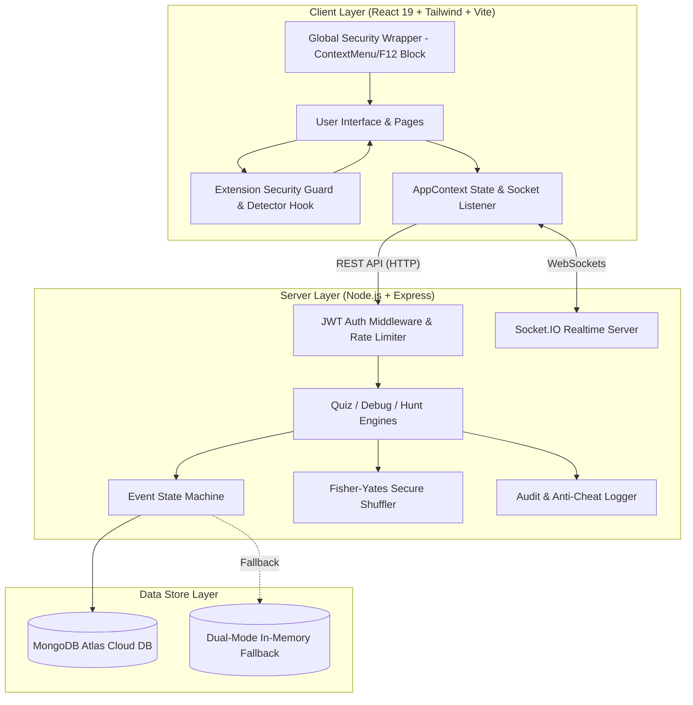

# FESTRONIX TECHNOVA 2026 — Master System Documentation

> **Official Symposium Event Management & Competition Platform**  
> *Department of Computer Science & Engineering | K. Ramakrishnan College of Technology (KRCT)*  
> **Theme:** Code the Ideas • Build the Tomorrow | **Tagline:** Decode, Debug & Discover

> [!IMPORTANT]
> **Bespoke & Event-Exclusive Architecture**  
> Unlike generic or off-the-shelf competition platforms, **FESTRONIX Technova** is a **custom-engineered, purpose-built platform created uniquely and exclusively for this single event** (FESTRONIX 2026 Technical Symposium at KRCT). Every workflow—from server-side question randomization to browser extension anti-tamper locking, Round 2 physical terminal PIN verification, Round 3 multi-station treasure hunting, and official question bank exports—is tailored specifically to the exact operational structure, rules, and lab setup of the Technova competition.

---

## 1. Executive Overview

**FESTRONIX Technova** is an end-to-end technical symposium event management and competitive examination system built specifically for the **FESTRONIX 2026 Symposium**. The software is uniquely crafted for this event's three progressive competition rounds:

1. **ROUND 1 — TECH QUIZ (Decode):** Automated multiple-choice technical examination powered by 100 curated CS questions across 10 domains, server-side Fisher-Yates question randomization, option shuffling, strict time tracking, and instant automated evaluation.
2. **ROUND 2 — DEBUG IT (Debug):** Practical code debugging challenge powered by 50 multi-language problems (C, Python, Java, C++, JS) where participants fix code on local IDE terminals and request lab coordinators for physical terminal execution inspection and PIN-authenticated score verification.
3. **ROUND 3 — TECH HUNT (Discover):** 50 multi-station technical treasure hunt with sequential clue solving, roadmap hints, time/score penalties, and real-time score tracking.

> [!TIP]
> **Official Event Rubrics & Scoring Guidelines**  
> Refer to the dedicated [`RUBRICS.md`](file:///o:/Festronix2k26_TechNova/RUBRICS.md) document for detailed 100-mark distribution tables, coordinator grading matrices, hint penalties, and tie-breaking hierarchies.

```
┌─────────────────────────────────────────────────────────────────────────┐
│                        FESTRONIX TECHNOVA PLATFORM                       │
└─────────────────────────────────────────────────────────────────────────┘
        │                                  │                                  │
        ▼                                  ▼                                  ▼
┌──────────────┐                  ┌────────────────┐                 ┌────────────────┐
│ Participant  │                  │  Lab/Faculty   │                 │   Super Admin  │
│   Portal     │                  │  Coordinators  │                 │ Control Center │
└──────────────┘                  └────────────────┘                 └────────────────┘
        │                                  │                                  │
        └──────────────────────────┬───────┴──────────────────────────────────┘
                                   ▼
┌─────────────────────────────────────────────────────────────────────────┐
│              BROWSER EXTENSION INTEGRITY & SECURITY GUARD               │
│     (Probes & blocks AI companions, DevTools, Tampermonkey scripts)     │
└─────────────────────────────────────────────────────────────────────────┘
                                   │
                                   ▼
┌─────────────────────────────────────────────────────────────────────────┐
│                     REST API & REAL-TIME SOCKET.IO                      │
└─────────────────────────────────────────────────────────────────────────┘
                                   │
                                   ▼
┌─────────────────────────────────────────────────────────────────────────┐
│         MONGODB ATLAS / DUAL-MODE IN-MEMORY PERSISTENCE STORE           │
└─────────────────────────────────────────────────────────────────────────┘
```

### Core Problems Solved

* **Browser Extension & AI Companion Blocking:** Probes and detects installed browser extensions (AI assistants, script injectors, grammar tools, devtools, auto-fillers) and strictly disables all login inputs until the user removes or disables them.
* **Elimination of Paper & Fragmented Tools:** Replaces disconnected quiz platforms, paper answer sheets, and manual score spreadsheets with a unified system.
* **Cheating Mitigation & Examination Security:** Combines real-time browser extension scanning, server-side payload sanitization (hiding correct answers and solution snippets), keyboard shortcut/right-click disabling, window focus tracking telemetry, and mandatory physical coordinator verification.
* **Fair Content Distribution:** Server-side Fisher-Yates shuffling ensures every participant receives a uniquely ordered set of questions and shuffled options.
* **Physical Lab Verification:** Solves the problem of unverified code submissions by requiring lab coordinators to inspect physical terminal execution and authorize scores via secure 4-digit PINs.
* **Dual-Mode Fault-Tolerant Persistence:** Features dual-mode persistence (MongoDB Atlas cloud connection with fallback to local dynamic memory store) and a 5-second automatic heartbeat sync for offline-first resilience.
* **Official Question Bank Excel Export:** Ready-to-print and auditable spreadsheet containing all 100 MCQs, 50 Debugging problems, 50 Tech Hunt clues, and official system user accounts.

---

## 2. Official Competition Question Bank & Excel Artifacts

The system is preloaded with an official seed repository containing 200 competition challenges in `server/src/seedData.js`. This repository has been structured and exported into a multi-sheet Microsoft Excel workbook for faculty review, audit compliance, and coordinator reference.

### Excel Export Files
- **Primary Excel Spreadsheet:** [`Festronix_TechNova_2026_Questions_Bank.xlsx`](file:///o:/Festronix2k26_TechNova/Festronix_TechNova_2026_Questions_Bank.xlsx)
- **Convenience Copy:** [`Technova_Questions_Bank.xlsx`](file:///o:/Festronix2k26_TechNova/Technova_Questions_Bank.xlsx)
- **Automated Generator Script:** [`export_to_excel.py`](file:///o:/Festronix2k26_TechNova/export_to_excel.py)

### Question Bank Breakdown

```text
Festronix_TechNova_2026_Questions_Bank.xlsx
├── Sheet 1: Round 1 - MCQs (100)
│   └── 10 Domains (DSA, Web & JS, OS, DBMS, Networks, OOP, Languages, Crypto, Cloud/AI, Bitwise Logic)
├── Sheet 2: Round 2 - Debugging (50)
│   └── Multi-Language (15 C, 15 Python, 15 Java, 5 C++/JS Practice) with Broken & Solution Code
├── Sheet 3: Round 3 - Tech Hunt (50)
│   └── 50 Station Checkpoints with Riddles, Secret Answer Keys, and Hints
└── Sheet 4: Official Accounts (Users)
    └── 7 Official Admin & Coordinator Credentials, Assigned Rounds, and 4-Digit Security PINs
```

| Round | Challenge Bank | Count | Breakdown / Domains |
| :--- | :--- | :---: | :--- |
| **Round 1 (Quiz)** | Multiple Choice Questions | **100** | Data Structures (10), Web & JS (10), OS (10), DBMS (10), Networks (10), OOP (10), Languages (10), Cybersecurity (10), Cloud & AI (10), Boolean Logic (10) |
| **Round 2 (Debug)** | Code Debugging Problems | **50** | 15 C Problems, 15 Python Problems, 15 Java Problems, 5 Bonus/Practice Problems (C++, JavaScript) |
| **Round 3 (Hunt)** | Tech Hunt Clues & Riddles | **50** | 50 Station Checkpoints with riddles, roadmap hints, answer keys, and penalty points |
| **Accounts** | Official System Users | **7** | 1 Super Admin (`ADMIN-01`) + 6 Lab Coordinators (`ECO-01` to `ECO-06`) with dedicated PINs |

---

## 3. Browser Extension Anti-Tampering & Security Engine

To uphold competitive fairness and prevent AI-assisted cheating (such as ChatGPT, Monica, Harpa AI, Sider, or Tampermonkey script injectors), the system features a dedicated **Browser Extension Integrity Enforcement Engine** on the login screen.

### Detection Architecture ([useExtensionDetector.js](file:///o:/Festronix2k26_TechNova/client/src/hooks/useExtensionDetector.js))



### Probed Extension Categories & Signatures

1. **AI Assistants & Cheating Tools:** Monica AI, Sider AI, Harpa AI, ChatGPT Sidebar, MaxAI, Merlin AI, Blackbox AI, Liner AI, SciSpace, Copyfish.
2. **Grammar & In-Page Injectors:** Grammarly (`grammarly-desktop-integration`, `grammarly-extension`, `[data-grammarly-shadow-root]`).
3. **Script Injectors & Automation:** Tampermonkey, Violentmonkey, Greasemonkey (`GM`, `GM_setValue`, `[data-v-userscript]`).
4. **Form Fillers & Password Managers:** LastPass, Dashlane, 1Password, Bitwarden, NordPass, Keeper.
5. **Theme & DOM Manipulators:** Dark Reader (`style.darkreader`, `DarkReader`), Night Eye.
6. **Developer & Inspection Tools:** React Developer Tools (`__REACT_DEVTOOLS_GLOBAL_HOOK__`), Web3 Wallets (`ethereum`, `solana`).
7. **Generic Extension Protocol Probing:** Scans all injected `<script>`, `<link>`, `<iframe>`, `<style>` matching `chrome-extension://`, `moz-extension://`, `edge-extension://`, `extension://`.

### User Experience & Enforcement ([LoginPage.jsx](file:///o:/Festronix2k26_TechNova/client/src/pages/LoginPage.jsx), [ExtensionSecurityGuard.jsx](file:///o:/Festronix2k26_TechNova/client/src/components/ExtensionSecurityGuard.jsx))
* **Locked Input Fields:** When an extension is detected, User ID and Password fields are marked `disabled={true}`, read-only with a `cursor-not-allowed` styling and a red padlock badge.
* **Security Guidance Tabs:** Displays clear step-by-step instructions for **Google Chrome**, **Microsoft Edge**, **Brave**, and **Incognito Mode**.
* **Instant Auto-Unlock:** Continuously re-scans every 2 seconds and upon clicking the **"Re-Scan"** button. The moment extensions are disabled, the portal unlocks immediately with a green `"🛡️ Browser Integrity Verified"` badge.

---

## 4. Implemented Roles & User Directory

The system implements Role-Based Access Control (RBAC) across database schemas (`User.role`), JWT payload claims, backend middleware (`authenticateToken`, `authorizeRole`), frontend context (`AppContext.jsx`), and dedicated coordinator round-locking.

### Official System Accounts Directory

| User ID | Role | Name | Assigned Scope / Round | Security PIN | Initial Password |
| :--- | :--- | :--- | :--- | :---: | :--- |
| **`ADMIN-01`** | `ADMIN` | Super Admin | All Rounds & System Settings | N/A | `CS2K26#AdminPass` |
| **`ECO-01`** | `COORDINATOR` | Lab Coordinator 1 | Lab Terminal 1 — Round 1 | `1201` | `ECO1Pass` |
| **`ECO-02`** | `COORDINATOR` | Lab Coordinator 2 | Lab Terminal 1 — Round 1 | `1302` | `ECO2Pass` |
| **`ECO-03`** | `COORDINATOR` | Lab Coordinator 3 | Lab Terminal 1 — Round 1 | `1403` | `ECO3Pass` |
| **`ECO-04`** | `COORDINATOR` | Lab Coordinator 4 | Lab Terminal 2 — Round 2 | `1504` | `ECO4Pass` |
| **`ECO-05`** | `COORDINATOR` | Lab Coordinator 5 | Lab Terminal 2 — Round 2 | `1605` | `ECO5Pass` |
| **`ECO-06`** | `COORDINATOR` | Lab Coordinator 6 | Lab Terminal 2 — Round 3 | `1706` | `ECO6Pass` |
| **`TN2026-001`** | `PARTICIPANT` | Registered Contestant | Competition Rounds | N/A | `TN2026-001` |

### "Who Does What?" Responsibility Matrix

| Activity | Super Admin | Lab Coordinator (R1) | Lab Coordinator (R2) | Lab Coordinator (R3) | Contestant (Participant) |
| :--- | :---: | :---: | :---: | :---: | :---: |
| Event State Control | ✅ | ❌ | ❌ | ❌ | ❌ |
| Set Qualification Limits | ✅ | ❌ | ❌ | ❌ | ❌ |
| Manage Question Bank | ✅ | ✅ | ✅ | ✅ | ❌ |
| JSON Bulk Import/Export | ✅ | ✅ | ✅ | ✅ | ❌ |
| Inspect Lab Terminal Execution | ❌ | ❌ | ✅ | ❌ | ❌ |
| Authorize PIN Grading | ❌ | ❌ | ✅ | ❌ | ❌ |
| View Anti-Cheat Telemetry Logs | ✅ | ❌ | ❌ | ❌ | ❌ |
| Participate in Active Round | ❌ | ❌ | ❌ | ❌ | ✅ |

---

## 5. Operations & User Journeys

### Faculty & Super Admin Guide
1. **Sign In:** Use `ADMIN-01` and password `CS2K26#AdminPass` on the login portal.
2. **Access Control Center:** Navigate to `/admin`.
3. **Configure Event State:** Move event state machine (`REGISTRATION` ➔ `ROUND_1_RUNNING` ➔ `ROUND_2_RUNNING` ➔ `ROUND_3_RUNNING` ➔ `COMPLETED`).
4. **Set Qualification Limits:** Define max participants passing from Round 1 to Round 2 (e.g. 30), and Round 2 to Round 3 (e.g. 10).
5. **Manage Content Bank:** Add, edit, clone, or bulk import/export questions across all 3 rounds.
6. **Monitor Live Telemetry:** Review anti-cheat logs (tab switches, focus loss) and live rankings.

### Lab Coordinator Guide (Round 2 Verification)
1. **Sign In:** Use assigned Coordinator ID (e.g. `ECO-04`) and password `ECO4Pass`.
2. **Access Workspace:** Navigate to `/coordinator`.
3. **Monitor Verification Queue:** Live queue receives participant submissions marked `WAITING VERIFICATION`.
4. **Physical Inspection:** Walk to the participant's physical workstation, inspect code execution in terminal/VS Code against expected output.
5. **Authorize Score:** Click **Perform Physical Verification**, enter Coordinator PIN (e.g. `1504`), assign awarded marks (0–10), and confirm. Marks stream live to the scoreboard.

### Participant User Journey
1. **Sign In:** Enter Participant ID (`TN2026-001`) and password.
2. **Round 1 (Tech Quiz):** Answer 20 server-randomized questions within 20 minutes under fullscreen proctoring.
3. **Round 2 (Debug It):** Fix broken code on local IDE, submit code and output, and notify the lab coordinator for physical PIN verification.
4. **Round 3 (Tech Hunt):** Solve multi-station clues sequentially, request roadmap hints if needed, and submit keys to complete checkpoints.

---

## 6. Technical Architecture



### Technology Stack Summary

| Layer | Technology | Version | Purpose |
| :--- | :--- | :--- | :--- |
| **Frontend Framework** | React.js | `^19.2.8` | Component-based single page UI |
| **Build Tool** | Vite | `^8.3.0` | High-speed development server & production bundler |
| **Styling** | Tailwind CSS | `^4.3.3` | Custom responsive design & dark/light theme |
| **Icons** | Lucide React | `^1.47.0` | UI icon library |
| **Realtime Client** | Socket.IO Client | `^4.8.3` | Live event state & verification updates |
| **Backend Runtime** | Node.js | ES Modules (`"type": "module"`) | Server runtime environment |
| **Web Server** | Express.js | `^4.19.2` | RESTful API routing & server middleware |
| **Realtime Server** | Socket.IO | `^4.7.5` | WebSockets server for real-time broadcasts |
| **Database ORM** | Mongoose | `^8.3.1` | MongoDB data modeling & schema validation |
| **Authentication** | JSON Web Tokens | `jsonwebtoken ^9.0.2` | Stateless bearer token authentication |
| **Security / Hashing**| Bcrypt.js | `^3.0.3` | Password hashing & verification |
| **Spreadsheet Engine**| OpenPyXL / Python | `3.x` | Multi-sheet Excel workbook export generation |

---

## 7. Complete API Reference

All backend API endpoints run on port `5000` (or `process.env.PORT`).

### Authentication & Security Endpoints

| Method | Endpoint | Access Level | Description |
| :--- | :--- | :--- | :--- |
| `POST` | `/api/auth/login` | Public (Rate-limited: 10/min) | Authenticates credentials, verifies Bcrypt password, issues 12h JWT token. |
| `POST` | `/api/auth/register` | Public | Registers a new participant, generates auto-incremented `TN2026-xxx` ID. |
| `GET` | `/api/anticheat/logs` | `ADMIN` | Fetches recorded tab blur and window unfocus security logs. |
| `POST` | `/api/anticheat/log` | `PARTICIPANT` (Automated) | Records a tab blur or window switch security signal. |

### Event State & Leaderboard Endpoints

| Method | Endpoint | Access Level | Description |
| :--- | :--- | :--- | :--- |
| `GET` | `/api/health` | Public | Returns database connection status and server timestamp. |
| `GET` | `/api/event/status` | Public | Returns current event state machine object. |
| `PUT` | `/api/event/settings` | `ADMIN` | Updates event status and qualification limits; emits Socket.IO update. |
| `GET` | `/api/dashboard/stats` | Public | Aggregates system metrics (registered count, submissions, verifications). |
| `GET` | `/api/leaderboard` | Public | Calculates aggregated total scores across all 3 rounds and ranks participants. |

### Round 1 — Quiz Engine Endpoints

| Method | Endpoint | Access Level | Description |
| :--- | :--- | :--- | :--- |
| `POST` | `/api/quiz/start` | `PARTICIPANT` | Generates or restores a randomized 20-minute quiz attempt; returns sanitized questions. |
| `GET` | `/api/quiz/current` | `PARTICIPANT` | Fetches active quiz attempt state and sanitized questions. |
| `POST` | `/api/quiz/answer` | `PARTICIPANT` | Saves selected option index for a question in real-time. |
| `POST` | `/api/quiz/submit` | `PARTICIPANT` | Evaluates answers, records score, marks attempt as `SUBMITTED`. |

### Round 2 — Debug Engine Endpoints

| Method | Endpoint | Access Level | Description |
| :--- | :--- | :--- | :--- |
| `POST` | `/api/debug/start` | `PARTICIPANT` | Assigns active debug problems; returns sanitized problem code/descriptions. |
| `GET` | `/api/debug/current` | `PARTICIPANT` | Fetches assigned debug problems for current participant attempt. |
| `POST` | `/api/debug/submit` | `PARTICIPANT` | Submits corrected solution code and output; queue status becomes `SUBMITTED`. |
| `GET` | `/api/coordinator/submissions` | `COORDINATOR` / `ADMIN` | Fetches queue of debug submissions requiring physical verification. |
| `POST` | `/api/coordinator/verify` | `COORDINATOR` / `ADMIN` | Authenticates Coordinator ID and 4-digit PIN; awards/modifies verification marks. |

### Round 3 — Tech Hunt Endpoints

| Method | Endpoint | Access Level | Description |
| :--- | :--- | :--- | :--- |
| `POST` | `/api/hunt/start` | `PARTICIPANT` | Initializes tech hunt attempt; returns current station clue. |
| `GET` | `/api/hunt/current` | `PARTICIPANT` | Fetches current hunt station status and active clue payload. |
| `POST` | `/api/hunt/:clueId/answer` | `PARTICIPANT` | Validates case-insensitive answer text; unlocks next station upon success. |
| `POST` | `/api/hunt/:clueId/hint` | `PARTICIPANT` | Unlocks station hint and records hint penalty flag. |

### Admin Content Management Hub Endpoints

| Method | Endpoint | Access Level | Description |
| :--- | :--- | :--- | :--- |
| `GET` | `/api/admin/questions` | `ADMIN` / `COORDINATOR` | Fetches MCQ bank with filters. |
| `POST` | `/api/admin/questions` | `ADMIN` / `COORDINATOR` | Creates a new MCQ question. |
| `PUT` | `/api/admin/questions/:id` | `ADMIN` / `COORDINATOR` | Updates existing MCQ question parameters. |
| `DELETE` | `/api/admin/questions/:id` | `ADMIN` / `COORDINATOR` | Removes MCQ question from bank. |
| `POST` | `/api/admin/questions/import` | `ADMIN` / `COORDINATOR` | Bulk imports MCQ array from JSON. |
| `GET` | `/api/admin/questions/export` | `ADMIN` / `COORDINATOR` | Exports full MCQ bank as downloadable JSON array. |
| `GET` | `/api/admin/debug-problems` | `ADMIN` / `COORDINATOR` | Fetches debug problems bank with filters. |
| `POST` | `/api/admin/debug-problems` | `ADMIN` / `COORDINATOR` | Creates a new debug problem. |
| `PUT` | `/api/admin/debug-problems/:id` | `ADMIN` / `COORDINATOR` | Updates debug problem parameters. |
| `DELETE` | `/api/admin/debug-problems/:id` | `ADMIN` / `COORDINATOR` | Removes debug problem from bank. |
| `POST` | `/api/admin/debug-problems/import` | `ADMIN` / `COORDINATOR` | Bulk imports debug problems array. |
| `GET` | `/api/admin/debug-problems/export` | `ADMIN` / `COORDINATOR` | Exports debug problems array as JSON. |
| `GET` | `/api/admin/clues` | `ADMIN` / `COORDINATOR` | Fetches tech clues bank with station/category filters. |
| `POST` | `/api/admin/clues` | `ADMIN` / `COORDINATOR` | Creates a new tech clue. |
| `PUT` | `/api/admin/clues/:id` | `ADMIN` / `COORDINATOR` | Updates tech clue parameters. |
| `DELETE` | `/api/admin/clues/:id` | `ADMIN` / `COORDINATOR` | Removes tech clue from bank. |
| `POST` | `/api/admin/clues/import` | `ADMIN` / `COORDINATOR` | Bulk imports tech clues array. |
| `GET` | `/api/admin/clues/export` | `ADMIN` / `COORDINATOR` | Exports tech clues array as JSON. |

---

## 8. Project Directory Structure

```text
Technova/
├── .env                              # Master root environment configuration
├── .gitignore                        # Git ignore patterns
├── README.md                         # Master repository documentation (This File)
├── RUBRICS.md                        # Official 100-Mark Event Evaluation & Scoring Rubrics
├── system                            # Master System Request & Requirements Specification
├── export_to_excel.py                # Question bank Excel generator script
├── Festronix_TechNova_2026_Questions_Bank.xlsx # Official Excel Question Bank
├── Technova_Questions_Bank.xlsx      # Convenience Question Bank Spreadsheet
├── client/                           # React Frontend Application
│   ├── .env                          # Client environment file (VITE_API_BASE)
│   ├── index.html                    # Single Page Application HTML entrypoint
│   ├── package.json                  # Frontend dependencies & Vite scripts
│   ├── vite.config.js                # Vite build configuration (Port 5173)
│   └── src/
│       ├── App.jsx                   # Main App component & Security Wrapper
│       ├── App.css                   # Keyframe animations & glassmorphic styling
│       ├── index.css                 # Global CSS & Tailwind CSS directives
│       ├── main.jsx                  # React DOM root renderer
│       ├── config.js                 # API base path resolution helper
│       ├── theme.js                  # Design system color tokens
│       ├── assets/                   # Static images, favicons, logos
│       ├── components/
│       │   ├── CinematicParticleCanvas.jsx # Interactive 3D particle background
│       │   ├── ContentManagementHub.jsx    # Universal MCQ/Debug/Clue Bank CRUD
│       │   ├── CoordinatorModal.jsx        # PIN Verification modal overlay
│       │   ├── ExtensionSecurityGuard.jsx  # Real-time Extension alert & instruction box
│       │   ├── Header.jsx                  # Top application header bar
│       │   ├── Sidebar.jsx                 # Main portal navigation sidebar
│       │   └── ProgressGauge.jsx           # Visual SVG gauge component
│       ├── context/
│       │   ├── AppContext.jsx        # App state, auth, heartbeat, telemetry
│       │   └── useApp.js             # Custom React hook for App context
│       ├── hooks/
│       │   ├── useExtensionDetector.js # Deep browser extension detection hook
│       │   └── useMotion.js          # Scroll reveal & animated counter hooks
│       └── pages/
│           ├── AdminPortal.jsx       # Super Admin Control Center (/admin)
│           ├── CoordinatorPortal.jsx # Coordinator Workspace (/coordinator)
│           ├── Dashboard.jsx         # Participant Main Dashboard (/dashboard)
│           ├── LandingPage.jsx       # Public Symposium Showcase Landing Page
│           ├── LoginPage.jsx         # Portal Authentication & Extension Lock Page
│           ├── Round1Quiz.jsx        # Round 1 Tech Quiz Examination Page
│           ├── Round2Debug.jsx       # Round 2 Debug It Code Editor Page
│           ├── Round3Hunt.jsx        # Round 3 Tech Treasure Hunt Page
│           └── SplashScreen.jsx      # Animated Compiler Sandbox Hero Screen
└── server/                           # Node.js Express Backend Application
    ├── .env                          # Server environment configuration
    ├── package.json                  # Backend dependencies & Node scripts
    └── src/
        ├── models.js                 # 12 Mongoose Schemas & Database Models
        ├── seed.js                   # Connection check utility script
        ├── seedData.js               # Official Question Seed Bank (100 MCQs, 50 Debug, 50 Hunt)
        └── server.js                 # Primary Express REST API & Socket.IO server
```

---

## 9. Local Development & Installation Guide

### Prerequisites
* **Node.js:** `v18.0.0` or higher
* **npm:** `v9.0.0` or higher
* **Python (Optional for Excel export):** `3.8+` with `openpyxl`

### Setup Instructions

```bash
# 1. Clone the repository
git clone https://github.com/TheOrionGD/Festronix2k26_TechNova.git
cd Festronix2k26_TechNova

# 2. Install Server Dependencies
cd server
npm install

# 3. Install Client Dependencies
cd ../client
npm install
```

### Seeding Official Accounts & Question Bank

To seed the database with all 100 MCQs, 50 Debugging problems, 50 Tech Hunt riddles, and 7 official accounts:
```bash
cd server
node src/seedData.js
```

### Exporting Questions to Excel

To generate an updated copy of the Excel Question Bank spreadsheet:
```bash
# Run from repository root
python export_to_excel.py
```

### Running the Application

Start Backend Server:
```bash
cd server
npm run dev
# Server running at http://localhost:5000
```

Start Frontend Client:
```bash
cd client
npm run dev
# Client running at http://localhost:5173
```

---

## 10. System Troubleshooting

| Symptom | Probable Cause | Resolution |
| :--- | :--- | :--- |
| **Login Inputs Locked ("Locked by Extension Policy")** | Browser extensions (AI assistants, Grammarly, Dark Reader, DevTools) detected. | Disable extensions in `chrome://extensions` or open in an **Incognito Window**, then click **"Re-Scan"**. |
| **"SYSTEM OFFLINE" Toast Appears** | Express server on port 5000 is stopped or unreachable. | Verify backend server is running using `npm run dev` in `/server`. |
| **MongoDB Connection Warning in Terminal** | Invalid `MONGODB_URI` or local MongoDB service stopped. | System automatically falls back to in-memory store; start local MongoDB or update Atlas URI in `server/.env`. |
| **"Invalid Coordinator Authorization PIN"** | Incorrect PIN entered during Round 2 physical verification. | Check PIN in the [Official Accounts Directory](#4-implemented-roles--user-directory) (e.g. `1504` for `ECO-04`). |
| **Rate Limit 429 Error on Login** | Exceeded 10 login attempts within 1 minute from same IP. | Wait 60 seconds before retrying login. |

---

*Documentation updated based on codebase analysis and official competition question bank integration for Festronix Technova 2026.*
