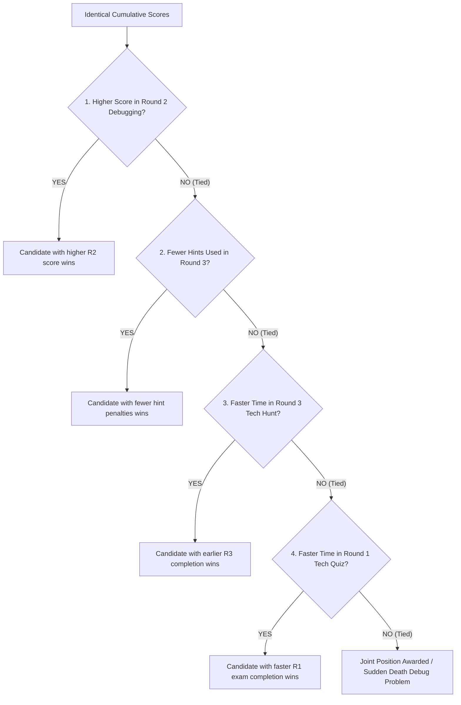

# FESTRONIX TECHNOVA 2026 — Official Event Rubrics & Evaluation Framework

> **Department of Computer Science & Engineering | K. Ramakrishnan College of Technology (KRCT)**  
> **Theme:** Code the Ideas • Build the Tomorrow | **Tagline:** Decode, Debug & Discover  
> **Target Audience:** Engineering & Computer Science Undergraduate Students  
> **Total Grand Marks:** **100 Marks** across 3 Progressive Evaluated Rounds  
> **Architecture Model:** Universal Participation with Isolated Server-Authoritative Graded Cohorts

---

## 1. Executive Scoring, Progression & Participation Architecture

Festronix TechNova 2026 operates on a **Universal Participation with Graded Cohort Separation** model. Every registered participant can experience and participate in all three rounds, ensuring maximal learning, inclusion, and engagement. Official scoring, prize qualification, and podium rankings are strictly governed by **server-authoritative graded cohorts** computed sequentially from official leaderboards.

| Round | Stage Name | Focus Area | Questions / Tasks | Round Weightage | Official Graded Cohort Rule | Non-Graded Participation |
| :---: | :--- | :--- | :---: | :---: | :---: | :---: |
| **Round 1** | **TECH QUIZ (Decode)** | Core Computer Science Fundamentals | 20 MCQs | **20 Marks** (20%) | **100% of Registered Participants** | N/A (Universal Graded Entry) |
| **Round 2** | **DEBUG IT (Debug)** | Code Bug Hunting & Physical IDE Execution | 3 Problems (+1 Bonus) | **30 Marks** (30%) | **Top 80%** from Round 1 Official Leaderboard | Open to all participants as non-graded practice |
| **Round 3** | **TECH HUNT (Discover)** | Multi-Station Technical Clue & Riddle Solving | 5 Stations | **50 Marks** (50%) | **Top 50%** from Round 2 Official Leaderboard | Open to all participants as non-graded exploration |
| **TOTAL** | **TECHNOVA CHAMPIONSHIP** | **Overall Technical & Algorithmic Excellence** | **28 Tasks** | **100 Marks** (100%) | **Top 3 Official Qualifiers** Declared Winners | Full learning experience for all attendees |

```
┌────────────────────────────────────────────────────────────────────────────────────────────────┐
│                    TECHNOVA 2026 TOURNAMENT DUAL PIPELINE ARCHITECTURE                         │
└────────────────────────────────────────────────────────────────────────────────────────────────┘
  Round 1: Tech Quiz (All Registered Participants)
  ├── Participation: 100% (Universal access)
  ├── Evaluation: 100% Graded Official [20 MCQs • 20 Mins]
  └── Official Leaderboard Generation
         │
         ├── Top 80% (Configurable) ──────────────────────────────┐
         └── Remaining 20%                                        │
                │                                                 │
                ▼                                                 ▼
  Round 2: Debug It!                               Round 2: Debug It!
  [Non-Graded Practice Cohort]                     [Official Graded Cohort]
  • Complete 3 + 1 bonus problems                  • Complete 3 + 1 bonus problems
  • Coordinator PIN code review                    • Coordinator PIN code review
  • Excluded from Official Leaderboard             • Scored towards R3 Qualification (Top 50%)
                │                                                 │
                │                                                 │
                ▼                                                 ▼
  Round 3: Tech Hunt                               Round 3: Tech Hunt
  [Non-Graded Exploration Cohort]                  [Official Graded Cohort]
  • 5 Station clues & riddles                      • 5 Station clues & riddles
  • Live solution verification                     • Scored towards Grand Championship
  • Excluded from Podium Ranks                     • 🥇 1st • 🥈 2nd • 🥉 3rd Podium Awards
```

---

## 2. Core Principles: Participation vs. Graded Cohorts

1. **Universal Access & Inclusion:**
   Every registered participant has full access to the workstation interfaces for Round 1, Round 2, and Round 3 once unlocked by the coordinator. No participant is ever locked out of a round purely due to academic qualification.
2. **Server-Authoritative Cohort Assignment:**
   Grading eligibility (`gradingStatus: 'graded'` vs. `'non_graded'`) is determined strictly server-side at the time an attempt is initialized. It is immutable and cannot be tampered with or overridden by client-side payloads.
3. **Zero Contamination Guarantee:**
   Non-graded participant attempts are stored for transparency, skill verification, and reporting, but they **never** alter, dilute, or affect official scores, rankings, percentile cutoffs, or podium positions.
4. **Dynamic Percentage Cutoff Formula:**
   Qualification cutoffs are dynamically computed using `ceil(totalParticipants * (percentage / 100))`, ensuring deterministic cohort sizing regardless of symposium attendance numbers.

---

## 3. Round 1: TECH QUIZ (Decode) — 20 Marks

### Objective
Assess breadth, speed, and analytical depth across core computer science and engineering disciplines through a server-randomized, time-restricted examination with instant answer synchronization.

### Configuration & Constraints
* **Question Bank Source:** 100 Curated MCQs across 10 Domains (from `Festronix_TechNova_2026_Questions_Bank.xlsx`).
* **Delivered Count:** 20 Random Questions per candidate via Fisher-Yates shuffle.
* **Duration:** **20 Minutes** (Strict countdown timer with automated submission upon expiry).
* **Environment Integrity:** Fullscreen enforced; **0 Browser Extensions Policy** enforced on login.
* **Interaction Model (Auto-Save & Smooth Advance):**
  * Selecting any option immediately sends `POST /api/quiz/answer` to persist the selection in the backend session.
  * The interface smoothly auto-advances to the next question after a **250ms** transition delay.
  * **Question Navigator Palette:** Participants can click any question number (1–20) or use the **Previous** button at any time to re-visit, inspect, or modify previously saved answers before submitting.
  * **Flag for Review:** Candidates can flag questions for later review without losing selected answers.

### Domain Distribution (2 Questions per candidate from each domain)
1. Data Structures & Algorithms
2. Web Technologies & JavaScript
3. Operating Systems & Architecture
4. Database Management & SQL
5. Computer Networks & Protocols
6. OOP & Software Design Patterns
7. Programming Language Internals (C, Python, Java)
8. Cybersecurity & Cryptography
9. Cloud Computing, DevOps & AI
10. Boolean Logic & Bitwise Computations

### Scoring Matrix

| Parameter | Criteria | Awarded Marks |
| :--- | :--- | :---: |
| **Correct Option** | Candidate selects the validated correct key (A, B, C, or D). | **+1.0 Mark** |
| **Incorrect Option** | Candidate selects an incorrect key. | **0.0 Marks** (No negative marks) |
| **Unanswered / Skipped** | Question left unanswered at submission time. | **0.0 Marks** |
| **Time Efficiency Bonus** | Millisecond-precision submission timestamp recorded. | **Tie-Breaker Factor** |

### Round 1 Graded Cohort & Qualification Rule
* All registered participants (100%) are evaluated as **Official Graded Participants** in Round 1.
* The top **80%** (default admin-configurable percentage, `roundGradingConfig[2]`) of the Round 1 official leaderboard qualify into the **Round 2 Official Graded Cohort**.
* Candidates outside the top 80% receive non-graded admission to Round 2.

---

## 4. Round 2: DEBUG IT (Debug) — 30 Marks

### Objective
Test practical debugging, compiler comprehension, memory safety, and algorithmic problem-solving by diagnosing broken code snippets in local IDEs and demonstrating live execution to lab coordinators.

### Configuration & Constraints
* **Problem Bank Source:** 50 Multi-Language Debugging Challenges (15 C, 15 Python, 15 Java, 5 C++/JS).
* **Assigned Problems:** **3 Graded Problems** (1 C, 1 Python, 1 Java) + **1 Bonus Practice Problem**.
* **Duration:** **45 Minutes**.
* **Grading Cohorts:**
  * **Official Graded Cohort:** Top 80% from Round 1 official leaderboard. Submissions count towards the cumulative leaderboard and Round 3 qualification.
  * **Non-Graded Cohort:** Remaining participants. Free to debug, execute, and request coordinator review for practice; scores are recorded with `gradingStatus: 'non_graded'` and do not alter the official leaderboard.
* **Verification Protocol:** Mandatory physical inspection by Lab Coordinators authenticated with an assigned 4-digit PIN.

### Coordinator Detailed Evaluation Rubric (10 Marks per Problem)

For each assigned problem, the lab coordinator evaluates the candidate's solution across four criteria:

```
┌────────────────────────────────────────────────────────────────────────┐
│             ROUND 2: COORDINATOR 10-MARK RUBRIC BREAKDOWN               │
├────────────────────────────┬───────────┬───────────────────────────────┤
│ Criterion                  │ Max Marks │ Evaluated Aspects             │
├────────────────────────────┼───────────┼───────────────────────────────┤
│ 1. Logic & Root Cause Fix  │  4 Marks  │ Bug accurately isolated & fixed│
│ 2. Test Output Conformance │  3 Marks  │ Output matches exact spec     │
│ 3. Code Quality & Standards│  2 Marks  │ No warnings, leaks, or hacks  │
│ 4. Verbal Viva / Defense   │  1 Mark   │ Clear explanation of the bug  │
├────────────────────────────┼───────────┼───────────────────────────────┤
│ TOTAL PER PROBLEM          │ 10 Marks  │ 3 Problems × 10 = 30 Marks    │
└────────────────────────────┴───────────┴───────────────────────────────┘
```

#### Detailed Criterion Descriptions

| Criterion | Excellent (Full Marks) | Good (Partial Marks) | Unsatisfactory (0 Marks) |
| :--- | :--- | :--- | :--- |
| **1. Root Cause Resolution (4 Marks)** | Correctly identifies and fixes the underlying syntactic/logical flaw (e.g. pointer leak, off-by-one, type mismatch). **[4 Marks]** | Partially addresses symptom with hardcoded values or suboptimal workaround. **[2 Marks]** | Bug remains present; code crashes, throws exceptions, or fails to compile. **[0 Marks]** |
| **2. Test Output Conformance (3 Marks)** | Output string, format, and return value match the expected problem specification perfectly. **[3 Marks]** | Output is correct but contains extra spacing, casing issues, or unformatted newlines. **[1.5 Marks]** | Incorrect output or segmentation fault / runtime crash. **[0 Marks]** |
| **3. Code Quality & Memory Safety (2 Marks)** | Clean syntax, proper indentation, resources freed (`free()`, `close()`), no compiler warnings. **[2 Marks]** | Code works but leaves memory leaks, unclosed streams, or sloppy indentation. **[1 Mark]** | Code contains major memory bugs or bad anti-patterns. **[0 Marks]** |
| **4. Live Explanation Viva (1 Mark)** | Candidate articulates clearly *what* the bug was and *why* their fix resolves it within 30 seconds. **[1 Mark]** | Vague or hesitant explanation; relies on trial-and-error without understanding. **[0.5 Marks]** | Cannot explain what change was made. **[0 Marks]** |

### Round 2 Qualification Rule
* The top **50%** (default admin-configurable percentage, `roundGradingConfig[3]`) of the **official Round 2 cohort** based on cumulative score $(R1 + R2)$ advance into the **Round 3 Official Graded Cohort**.
* All other contestants can participate in Round 3 as non-graded participants.

---

## 5. Round 3: TECH HUNT (Discover) — 50 Marks

### Objective
Test rapid lateral thinking, algorithmic riddles, cryptography, systems hardware clues, and physical campus checkpoint traversal under competitive pressure.

### Configuration & Constraints
* **Clue Bank Source:** 50 Station Riddles with secret cryptographic/hardware answer keys.
* **Stations to Complete:** **5 Sequential Stations**.
* **Duration:** **40 Minutes**.
* **Progression:** Linear unlock (Station $N+1$ unlocks only after successfully submitting the key for Station $N$).
* **Grading Cohorts:**
  * **Official Graded Cohort:** Top 50% from Round 2 official leaderboard. Scores count toward Grand Total and Championship Podiums.
  * **Non-Graded Cohort:** Remaining participants. Free to solve clues and explore stations for experience with a `◎ Non-Graded` badge.

### Scoring Matrix per Station (10 Marks × 5 Stations = 50 Marks)

| Station Action | Condition / Criteria | Point Adjustment |
| :--- | :--- | :---: |
| **Correct Answer Submitted** | Candidate enters matching case-insensitive secret key on first try. | **+10 Marks** |
| **Hint Requested (Roadmap Clue)** | Candidate clicks "Unlock Roadmap Hint" to reveal station location clue. | **-2 Marks Penalty** |
| **Net Station Score (With Hint)** | Station solved successfully after viewing the roadmap hint. | **+8 Marks** |
| **Incorrect Submission** | Wrong key entered (candidates may retry without point penalty). | **0 Marks (Retry permitted)** |
| **Skipped Station (Pass / Move On)** | Candidate opts to skip station to unlock next clue without dead-end blocking. | **0 Marks (Advances progression)** |
| **Unsolved Station** | Station not reached or unsolved before 40-minute timer expires. | **0 Marks** |

### Speed Multiplier & Bonus for Round 3
* **Speed Rank Recording:** The platform server logs the exact millisecond timestamp when Station 5 is submitted.
* **First Finisher Bonus:** In the event of a tie in total points, the finalist with the earliest completion timestamp claims precedence.

---

## 6. Leaderboard Ranking & Qualification Filtering Engine

The TechNova platform uses an automated dual-tier qualification and ranking engine (`computeLeaderboardData()`) that filters, sorts, and determines cohort eligibility after every round.

```
┌─────────────────────────────────────────────────────────────────────────────────────────────────────────────┐
│                                   TOURNAMENT DUAL-TIER RANKING SYSTEM                                       │
├─────────────────┬──────────────────────┬─────────────────────────────┬──────────────────────────────────────┤
│ Tournament Tier │ Target Participants  │ Filtering & Cutoff Formula  │ Advancement Outcome                  │
├─────────────────┼──────────────────────┼─────────────────────────────┼──────────────────────────────────────┤
│ 1. Tech Quiz    │ All Registered       │ Top 80% (Configurable)      │ Top 80% earn `isGradedR2 = true`     │
│    (Round 1)    │ ($N$ Contestants)    │ `ceil(N * 0.80)` on R1      │ (Remaining = Round 2 Non-Graded)     │
├─────────────────┼──────────────────────┼─────────────────────────────┼──────────────────────────────────────┤
│ 2. Debug It!    │ All Participants     │ Top 50% (Configurable)      │ Top 50% earn `isGradedR3 = true`     │
│    (Round 2)    │ (Graded + Non-Graded)│ `ceil(N * 0.50)` on R1+R2   │ (Remaining = Round 3 Non-Graded)     │
├─────────────────┼──────────────────────┼─────────────────────────────┼──────────────────────────────────────┤
│ 3. Tech Hunt    │ All Participants     │ Official Graded Cohort Only │ 🥇 1st Place (Champion)              │
│    (Round 3)    │ (Graded + Non-Graded)│ Rank 1 to 3 on Grand Total  │ 🥈 2nd Place (Runner-Up)             │
│                 │                      │ ($R1 + R2 + R3$ / 100 pts)  │ 🥉 3rd Place (2nd Runner-Up)         │
└─────────────────┴──────────────────────┴─────────────────────────────┴──────────────────────────────────────┘
```

### 6.1 Round-by-Round Filtering & Sorting Rules

#### A. Round 1 Ranking & Filtering (100% Graded -> Top 80% R2 Graded Cohort)
* **Eligible Pool:** All registered candidates who started/submitted Round 1.
* **Sort Key 1 (Primary):** `r1Score` **DESC** (Max 20 marks).
* **Sort Key 2 (Tie-Breaker 1 - Speed):** `r1Duration` **ASC** (Milliseconds between `startedAt` and `submittedAt`).
* **Sort Key 3 (Tie-Breaker 2 - Timestamp):** `r1SubmittedAt` **ASC** (Earliest submission clock time).
* **Cohort Assignment:** Candidates with `Rank <= calculateQualifiedCount(N, 80)` receive `qualifiedR2 = true` and `isGradedR2 = true`. All remaining participants can enter Round 2 with `isGradedR2 = false`.

#### B. Round 2 Ranking & Filtering (Top 50% R3 Graded Cohort)
* **Official Graded Pool:** Candidates who achieved `isGradedR2 = true` from Round 1.
* **Sort Key 1 (Primary):** Cumulative $(R1 + R2)$ Score **DESC** (Max 50 marks).
* **Sort Key 2 (Tie-Breaker 1 - Debug Mastery):** Higher isolated `r2Score` **DESC** (Max 30 marks).
* **Sort Key 3 (Tie-Breaker 2 - Verification Speed):** `r2LatestVerified` **ASC** (Earliest coordinator verification timestamp).
* **Sort Key 4 (Tie-Breaker 3 - R1 Precedence):** Higher Round 1 Rank (`r1Rank` ASC).
* **Cohort Assignment:** Candidates with `Rank <= calculateQualifiedCount(N, 50)` receive `qualifiedR3 = true` and `isGradedR3 = true`. All remaining participants can enter Round 3 with `isGradedR3 = false`.

#### C. Round 3 Grand Finale & Podium Ranking (Rank 1, 2, 3)
* **Official Graded Pool:** Candidates who achieved `isGradedR3 = true`.
* **Sort Key 1 (Primary):** Grand Total Cumulative Score $(R1 + R2 + R3)$ **DESC** (Max 100 marks).
* **Sort Key 2 (Tie-Breaker 1):** Higher `r2Score` (Debugging precision under pressure).
* **Sort Key 3 (Tie-Breaker 2):** Fewer Hint Penalties incurred in Round 3.
* **Sort Key 4 (Tie-Breaker 3):** `r3SubmittedAt` **ASC** (Earliest completion timestamp of Station 5).
* **Sort Key 5 (Tie-Breaker 4):** Faster Round 1 test completion speed.
* **Podium Classification:**
  * **Rank 1:** 🥇 **TechNova 2026 Champion**
  * **Rank 2:** 🥈 **First Runner-Up**
  * **Rank 3:** 🥉 **Second Runner-Up**

---

### 6.2 Live Portal Leaderboard Filtering Modes

The Coordinator and Admin Portals offer real-time telemetry filtering views:

| Filter Tab | Data Subset | Display Badges | Primary Use Case |
| :--- | :--- | :--- | :--- |
| **`ALL` (Overall Standings)** | All registered participants ($N$) | `✓ Graded Official` / `◎ Non-Graded` | Comprehensive symposium participation overview |
| **`R1` (Round 1 Results)** | All participants who took Quiz | `✓ Graded Official` | Cutoff verification for Round 2 Graded Cohort (Top 80%) |
| **`R2` (Round 2 Standings)** | Graded cohort + Non-graded attempts | `✓ Graded Official` (Top 80%) / `◎ Non-Graded` | Live coordinator verification tracking & Round 3 cutoff |
| **`R3` (Round 3 Podium)** | Graded cohort + Non-graded attempts | `✓ Graded Official` (Top 50%) / `◎ Non-Graded` | Live tracking of campus treasure hunt & winner declaration |
| **Live Search Query** | Substring matches on `id`, `name`, or `college` | Retains active grading tags | Instant candidate lookup during coordinator viva verification |

---

## 7. Master Tie-Breaking Hierarchy

If two or more candidates have identical scores on the final leaderboard, the winner is determined using the following strict sequential rules:



---

## 8. Code of Conduct, Anti-Cheat & Penalties

To ensure 100% integrity across all computer laboratories, the following automated and coordinator-enforced rules apply:

| Infraction | Detection Mechanism | Penalty / Action |
| :--- | :--- | :--- |
| **Active Browser Extensions** | Automated client-side probe ([useExtensionDetector.js](file:///o:/Festronix2k26_TechNova/client/src/hooks/useExtensionDetector.js)) | **Login Input Locked.** Contestant cannot type or sign in until all extensions are removed/disabled. |
| **Tab Switching / Window Unfocus** | `document.hidden` browser telemetry logged to `/api/anticheat/log` | **Warning on 1st & 2nd offense.** 3rd offense triggers coordinator review and **-5 Marks penalty**. |
| **DevTools / Inspect Shortcut (F12, Ctrl+Shift+I)** | Event key listener intercepted & blocked | Keystroke cancelled; telemetry signal dispatched to server. |
| **External AI Assistance (ChatGPT, Monica, etc.)** | Extension probe + physical proctor monitoring | **Immediate Disqualification (DQ)** from tournament. |
| **Sharing Secret Keys / Clues in Round 3** | Coordinator surveillance & audit log check | **Immediate Disqualification** of both involved teams. |

---

## 9. Coordinator PIN Verification Protocol

All Lab Coordinators must adhere to the following 5-step grading protocol for Round 2:

1. **Verify Identity:** Check contestant badge against system ID (`TN2026-xxx`).
2. **Terminal Inspection:** Require the student to compile and run their code in their IDE / terminal.
3. **Inspect Output:** Verify output against the problem's expected output specified in [`Festronix_TechNova_2026_Questions_Bank.xlsx`](file:///o:/Festronix2k26_TechNova/Festronix_TechNova_2026_Questions_Bank.xlsx).
4. **Conduct 30-Second Viva:** Ask candidate to explain the line(s) changed and why the bug occurred.
5. **Enter PIN & Marks:** Open Coordinator Modal on participant workstation or coordinator portal, input assigned 4-digit PIN (e.g. `1504` for `ECO-04`), select awarded marks (0–10), and submit.

---

## 10. Awards & Certificate Allocation

| Award Category | Qualification Criteria | Recognition |
| :--- | :--- | :--- |
| 🥇 **TechNova 2026 Champion (1st Place)** | Highest Total Cumulative Score $(R1 + R2 + R3)$ in Official Graded Cohort | Winner Trophy + Certificate of Excellence + Cash Award |
| 🥈 **First Runner-Up (2nd Place)** | 2nd Highest Cumulative Score in Official Graded Cohort | Trophy + Certificate of Excellence + Cash Award |
| 🥉 **Second Runner-Up (3rd Place)** | 3rd Highest Cumulative Score in Official Graded Cohort | Trophy + Certificate of Excellence + Cash Award |
| 🎖️ **Grand Finalist (Top 50% Cohort)** | Qualified for Round 3 Official Graded Cohort | Certificate of Merit |
| 📜 **Round 2 Qualifier (Top 80% Cohort)** | Qualified for Round 2 Official Graded Cohort | Certificate of Participation & Round 2 Graded Qualification |
| 📄 **All Participants (Universal)** | Successfully participated in Festronix TechNova 2026 | Certificate of Participation |

---

*Official Event Evaluation Rubrics Approved for Festronix 2026 — TechNova by the Department of Computer Science & Engineering, K. Ramakrishnan College of Technology.*
